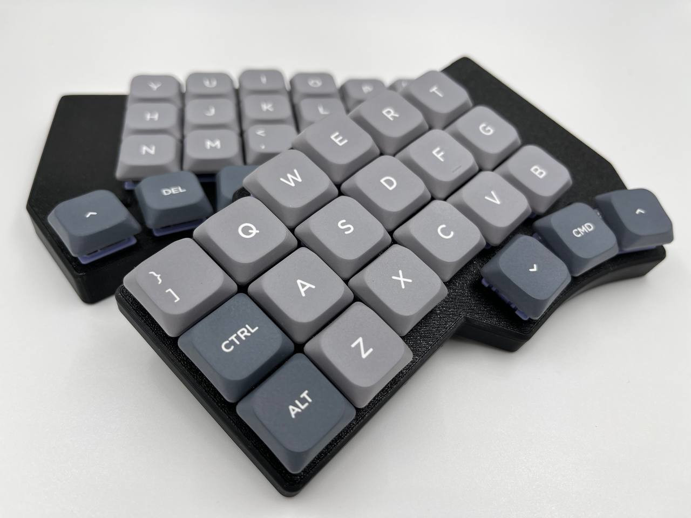

# Ergonaut One

Ergonaut One is an open-source ergonomic wireless split mechanical keyboard designed by Ergonaut Keyboards.

Inspiration for the keyboard was taken from these projects:

* [Corne](https://github.com/foostan/crkbd) by [foostan](https://github.com/foostan)
* [Dao](https://github.com/yumagulovrn/dao-choc-ble) by [yumagulovrn](https://github.com/yumagulovrn)

## Idea

We wanted to create a pretty affordable, nice looking, and, most importantly, very DIY-friendly ergonomic wireless split keyboard with Gateron Low Profile switches.

## Features

* Low-profile, which will reduce strain on your beautiful hands;
* Split. You can put the keyboard where it'll be comfortable exactly for you;
* Pretty long battery life. 250mAh battery gives up to a month of usage without charging;
* Wide availability and range of [compatible keycaps](../../switches/gateron-low-profile#keycaps-compatibility);
* Budget-friendly, because:
  * It uses relatively cheap and widely available [Seeed Studio XIAO nRF52840](https://wiki.seeedstudio.com/XIAO_BLE/) as MCU;
  * It uses one PCB design for both halves of the keyboard;
  * Everything except PCB's, components and hardware (screws, nuts) can be 3D printed.
* Beginner-friendly, because:
  * PCB is easy to solder;
  * Cases are easy to print.
* Wireless by design - no unnecessary wires, no unused connectors on the board;
* Free in terms of hardware design. It's licensed under permissive [CERN-OHL-P v2](https://ohwr.org/cern_ohl_p_v2.pdf) license, which means:
  * you are free to manufacture it yourself;
  * you are free to sell your manufactured hardware for profit.

## Build Guide

BOM and Build Guide can be found in [Ergonaut Keyboards Documentation Portal](https://ergonautkb.github.io/docs/keyboards/ergonaut-one/intro).

## Firmware

Firmware can be found in [one-zmk-config](https://github.com/ergonautkb/one-zmk-config) repository.

## Contacts

* Documentation portal: https://ergonautkb.github.io
* Telegram: https://ergonautkb.t.me
* Telegram (ru): https://ergonautkb_ru.t.me
